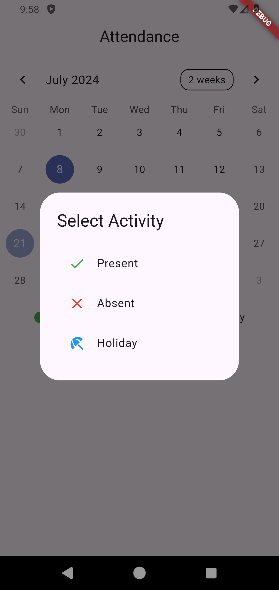
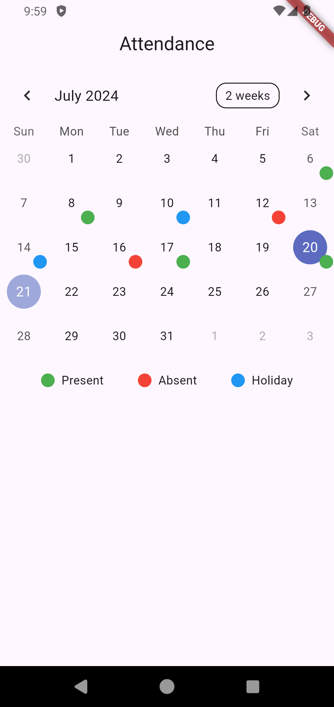

# Attendance Calendar

A simple Flutter application that allows users to mark attendance on a calendar. Users can select a day and mark it as Present, Absent, or Holiday.

## Features

- View a calendar with selectable dates.
- Mark dates with different statuses (Present, Absent, Holiday).
- Visual indicators for each status.
- Legend for quick reference of statuses.

## Screenshots




## Getting Started

These instructions will get you a copy of the project up and running on your local machine for development and testing purposes.

### Prerequisites

- Flutter SDK: [Install Flutter](https://flutter.dev/docs/get-started/install)
- Dart SDK: Comes with Flutter
- Any IDE with Flutter support (VSCode, IntelliJ, Android Studio)

### Installing

1. **Clone the repository:**

    ```sh
    git clone https://github.com/Developer-ritesh/todo_calender.git
    ```

2. **Navigate to the project directory:**

    ```sh
    cd todo_calender
    ```

3. **Install dependencies:**

    ```sh
    flutter pub get
    ```

4. **Run the app:**

    ```sh
    flutter run
    ```

## Project Structure

```plaintext
todo_calender/
├── android
├── build
├── ios
├── lib
│   ├── main.dart
├── screenshots
│   └── screenshot1.png
├── test
├── pubspec.yaml
└── README.md
```

- lib/main.dart: Entry point of the application.
- lib/attendance_screen.dart: Contains the main screen with the calendar.
- lib/widgets/legend.dart: Widget for the legend display.
- lib/widgets/marker.dart: Widget for calendar markers.
- screenshots: Folder to store screenshots of the application.


## Usage
- Selecting a Day: Tap on a day to open the activity selection dialog.
- Marking Attendance: Choose from Present, Absent, or Holiday to mark the selected day.
- Viewing Legends: Refer to the legend at the bottom for color-coded status indicators.

## Contributing
- Fork the repository
- Create your feature branch:

```
git checkout -b feature/todo_calender
```

- Commit your changes:

```
git commit -m 'Add some feature'
```

- Push to the branch:

```
git push origin feature/todo_calender
```

- Create a new Pull Request

## License
This project is licensed under the MIT License - see the LICENSE file for details.

# Acknowledgments

- Flutter documentation: flutter.dev
- TableCalendar package: pub.dev/packages/table_calendar


Replace `https://github.com/Developer-ritesh/todo_calender.git` with the actual URL of your repository. You can add screenshots in the `screenshots` directory and update the path in the README accordingly.
